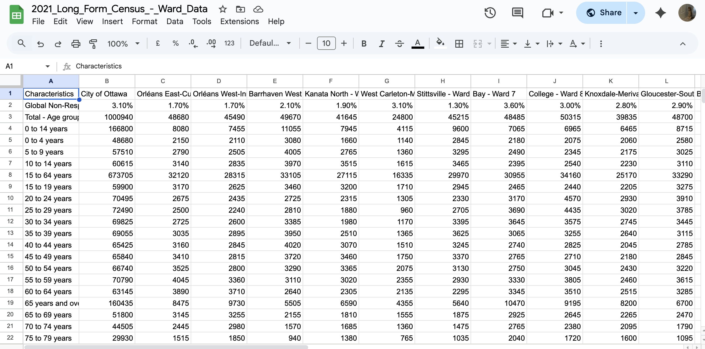
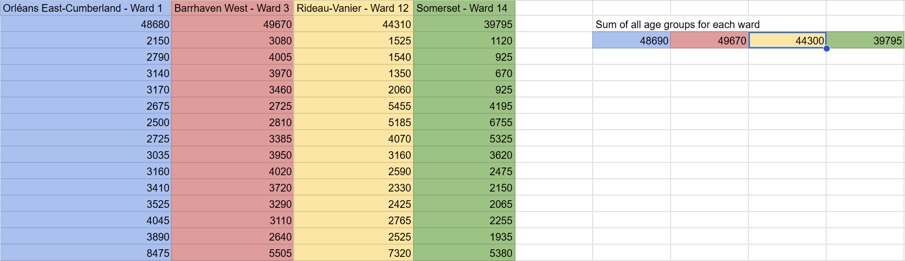
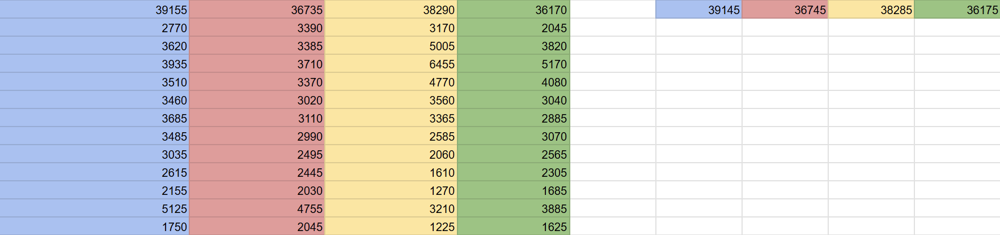
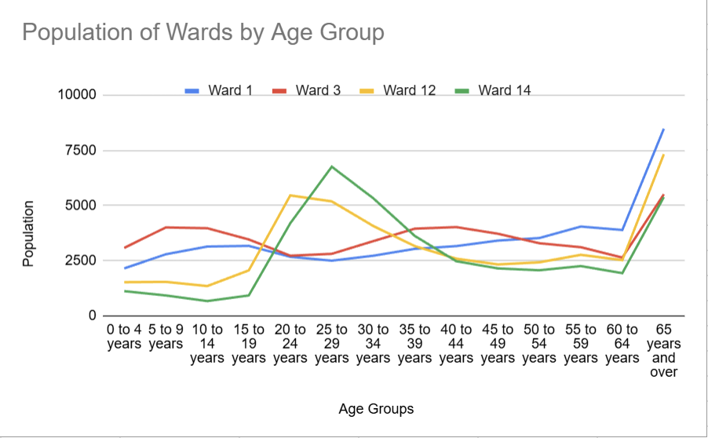
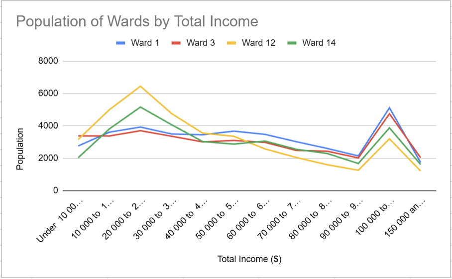
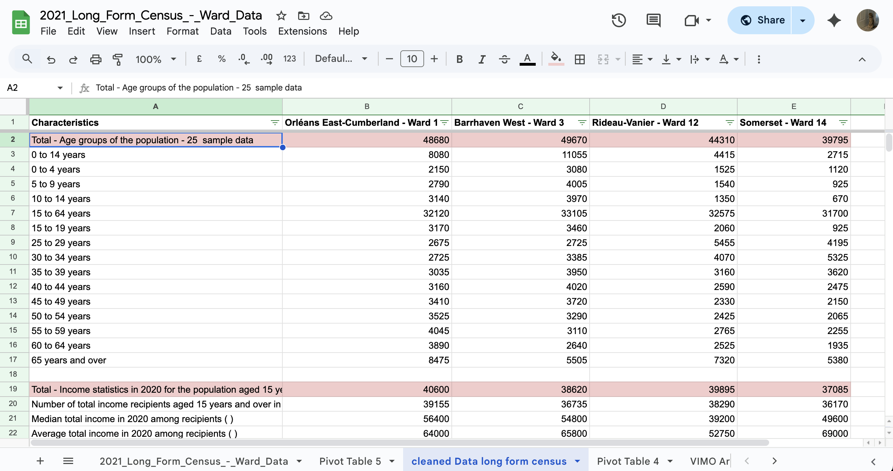
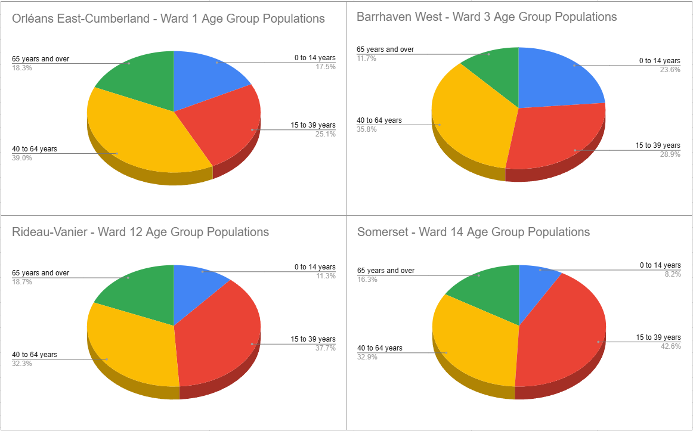
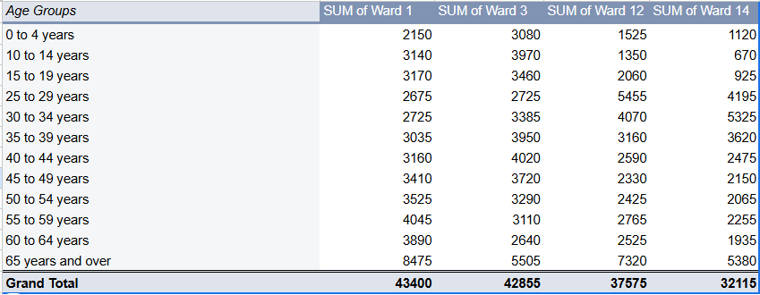

**November 6, 2025** 
**MPAD 2003A Introductory Data Storytelling** 
**Joshua Alam, Dana Al-Damiri, Isabel Yome** 
**Presented to Jean-Sébastien Marier** 

# Exploratory Data Analysis (EDA) & Pitch

## 1. Introduction

For this assignment, we will be analyzing the City of Ottawa’s 2021 Long Form Census. The census is done every 5 years, with a short form questionnaire sent to 100% of households in Ottawa and a long form census sent to only 25% of Ottawa’s households, and the ward data updated 2 years later. 

It contains information on age groups, marriage status, how many people live in the house, employment, income, languages spoken, and more. The dataset compares Ottawa’s wards. The long form census has more than three times the amount of rows than the short form census in order to get a deeper understanding of Ottawa’s population and demographics.

Link to the original dataset: https://open.ottawa.ca/datasets/ottawa::2021-long-form-census-ward-data/about

Link to the CSV file: https://raw.githubusercontent.com/jsmarier/files-for-course-assignments/refs/heads/main/2021_Long_Form_Census_-_Ward_Data.csv

In the following sections, we will be describing how the dataset was originally, and how we cleaned it for our purposes. We will then detail our analysis of the dataset, and the story that we found within.

## 2. Getting Data

To import the dataset into Google Sheets, the first step is to right-click on the webpage containing the data and select “Save as.” After saving the file to your computer, open Google Sheets and import the saved data file. When the import window appears, make sure to change the separator type to “comma” to ensure that the values are properly formatted into separate columns. Once imported, the dataset reveals that it contains 26 columns and 2000+ rows, making it quite large and complex. At first glance, the data appears messy and unclear, as it includes mixed data types within several columns and rows that represent totals or subtotals rather than specific wards. These non-ward rows should be excluded to maintain clarity and accuracy in the analysis. The dataset is also wide, meaning that each variable, such as income, population, or education level, is represented by a separate column rather than grouped categories.
Focusing on specific wards, several patterns emerge. In Rideau-Vanier (Ward 12), the quantitative continuous variables show that this area generally has a lower median total income compared to suburban wards, suggesting higher levels of economic inequality in Ottawa’s central neighborhoods. The proportion of residents aged 0–14 years is relatively low, indicating fewer families with young children. Similarly, Somerset (Ward 14) also shows continuous quantitative data, typically reflecting the lowest median household income among all wards, a smaller percentage of children, and a higher share of working-age adults. By contrast, Barrhaven West (Ward 3) demonstrates higher median household incomes and one of the largest youth populations, aligning with its suburban, family-oriented character. Education levels are relatively high here, though slightly below those of more urban wards. Finally, Orleans East-Cumberland (Ward 1) displays strong middle to upper-middle-class characteristics, with high median incomes and one of the highest proportions of children, further emphasizing its family-centered demographic.
Overall, this dataset primarily contains discrete and quantitative variables. A key research question that emerges from these observations is: How do income levels and age distributions differ between downtown and suburban wards in Ottawa, and what might these differences reveal about family demographics and economic inequality?

Here is a link to the googlesheets spreadsheet: https://docs.google.com/spreadsheets/d/16tJjQn6W34JQ_Rc1QmY7sKetsYflTDc6xKRWELXjo8k/edit?usp=sharing    

## 3. Understanding Data

### 3.1. VIMO Analysis

The dataset comes from a questionnaire sent to 25% of households in Ottawa. This means that it does not represent the entire population of the city. While this is true, the dataset is still useful for identifying general trends.

The data that who's validity and accuracy I analyzed was pertaining to the number of people in different age groups and total income levels of the four wards we chose to represent the suburbs and downtown: Orleans East-Cumberland (Ward 1) and Barrhaven West (Ward 3) for the suburbds; Rideau-Vanier (Ward 12), and Somerset (Ward 14) for downtown. 

First, I added the number of people in different age groups according to the table together for each ward to see if they add up to the total number of people in the ward. I did this using the `SUM` function. I found that the sum of all age groups for each ward were equal to their total population +/- 10.
 

*Figure 1: This table shows the populations of each ward, the number of people in different age groups, and the sums of all the age groups for each ward*

I did the same with the different total income levels for each ward. I also found that the sum of the different total income levels of each ward were equal to their population with total income +/- 10.
 

*Figure 2: This table shows the populations of each ward, the number of people in different income levels, and the sums of all the income levels for each ward*

Next, I checked for outliers in the dataset. I did this by putting the data for the age groups of each ward, and the data for the total income levels of each ward into line graphs.
 

*Figure 3: This graph shows trends in the populations of different age groups in four wards*

*Figure 4: This graph shows trends in the populations of different income levels in four wards*

As we can see in the graphs, the data follows each other's trends, and there are no datapoints that are wildly out of place.

After this VIMO analysis, I have concluded that this dataset is valid, accurate, and fit for further analysis.
### 3.2. Cleaning Data

To prepare the dataset for analysis, I began by deleting all unnecessary columns and rows, keeping only five key columns that were most relevant to the story. This helped simplify the data and focus on what was most important. I then froze the first row to keep the column headers visible while scrolling, ensuring the data remained consistent and easy to follow. After that, I created filters for all rows, which made sorting and searching for specific information much easier. I also removed any duplicate rows to avoid repetition and maintain data accuracy. Using the “Find and Replace” function in Google Sheets allowed me to correct or update recurring entries efficiently. Once the structure was cleaned, I focused on trimming the dataset further by deleting rows that did not relate directly to the story. I was able to remove data that were not relevant to income, and age. This step was especially time-consuming since the dataset originally contained over 2,000 rows. I carefully went through each section, separating different variable groups to make the data clearer and more organized. After this process, the dataset was reduced to just over 200 rows, leaving only the information most relevant to the story and making it much easier to interpret and analyze.

 

### 3.3. Exploratory Data Analysis (EDA)

We chose to look at the income and age differences between wards in downtown and suburban Ottawa because we noticed that they follow different trends and wanted to know why that might be. 

Something that stands out to me is that the population of age demographics of the wards in the suburbs is fairly consistent, while in downtown, they vary wildly, suddenly rising and then falling. A potential story here could be investigating the reasons that the number of people increases from ages 15 to 29 in downtown, then begins to decrease again, before settling at ages 45 and up (refer to figure 3).  

*Figure 5: Pie charts showing the age demographics in the four wards*
The number of people in different income levels in downtown are similarly erratic, whereas the distribution is again consistent in the suburbs. We could look at if and why the stats generally seem to be more erratic in downtown wards, while the stats in suburban wards seem to be more steady (refer to figure 4).

*Figure 5: Pivot table showing the age groups of the four wards*
## 4. Potential Story

As we know, a long form census collects detailed information about a city and its residents. It can be used to help provide insight into what life in Ottawa is like in each of the different wards. Our data revealed interesting patterns that could be used to tell numerous stories. If we were to create our own story from the dataset we analyzed, our focus would be on the variation in age distributions across different wards. Why does Barrhaven West have more young people than any other ward? Does this mean it is a better place for raising a family? Why and why not? With further research, these questions could lead to some newsworthy stories. 

These questions prompted us to do additional research. We wanted to see if the wards with larger portions of people aged 0-14 years were advertised as family-friendly neighbourhoods, and why. Lots of online articles and blogs suggested Barrhaven and Orléans as family-friendly neighbourhoods, which aligns with what our data shows us. Furthermore, we found on the City of Ottawa website that Barrhaven and Orléans have more schools than most districts. Having more schools and amenities in the area attracts young families, which is clearly reflected in this data. 

It would be a good idea to interview the councillors from any of the wards. For example, an interview with Rideau-Vanier’s councillor Stephanie Plante would be a perfect opportunity to ask about what can be done to attract more young families to the area. Or in an interview with Barrhaven West’s David Hill or Orléans’ Matthew Luloff we could ask about what they think makes the area so ideal for young families. 

## 5. Conclusion

Throughout this project, our goal was to explore the City of Ottawa’s 2021 Long Form Census and uncover meaningful stories within the data. Our analysis focused on comparing suburban and downtown wards, specifically examining how age distribution and income levels vary across these areas. In doing so, we gained valuable insights into the relationship between geography, family demographics, and economic inequality in Ottawa.
The most challenging part of this assignment was cleaning and organizing the data. The dataset was large, detailed, and occasionally inconsistent, which required patience and careful attention to ensure accuracy. Another challenge was narrowing down our focus. There were so many possible directions the data could lead us, but we learned the importance of selecting a clear and specific research question.
The most rewarding aspect was discovering patterns that told a real story about the city we live in — such as why certain areas attract young families. Also, seeing that data displayed graphically was very satisfying, especially after knowing what the data looked like to start with.  

## 6. References

Include a list of your references here. Please follow [APA guidelines for references](https://apastyle.apa.org/style-grammar-guidelines/references). Hanging paragraphs aren't required though.

**Here's an example:**

Bounegru, L., & Gray, J. (Eds.). (2021). *The Data Journalism Handbook 2: Towards A Critical Data Practice*. Amsterdam University Press. [https://ocul-crl.primo.exlibrisgroup.com/permalink/01OCUL_CRL/hgdufh/alma991022890087305153](https://ocul-crl.primo.exlibrisgroup.com/permalink/01OCUL_CRL/hgdufh/alma991022890087305153)
